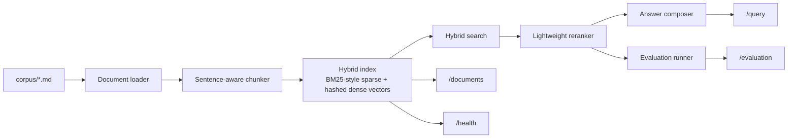

# rag-ops-platform

A production-style RAG service that ingests a small document corpus, builds a transparent hybrid retrieval index, reranks candidate chunks, and returns citation-backed answers plus retrieval evaluation metrics.

The current V1 runs fully local and does not require external model credentials or hosted vector infrastructure.

## Problem

Many RAG demos prove that a model can answer questions, but they do not prove that the retrieval layer is grounded, inspectable, or testable. This project focuses on the infrastructure around the answer: corpus ingestion, chunking, hybrid retrieval, ranking traces, citations, and evaluation hooks that make the system interview-defensible.

## Architecture

The current V1 is intentionally local and deterministic. Instead of hiding the system behind hosted vector services or framework abstractions, the repo shows the moving parts directly:

- Markdown documents are loaded from a versioned sample corpus.
- The ingestion layer creates sentence-aware chunks with one-sentence overlap.
- Each chunk is indexed with a BM25-style sparse representation and a hashed dense vector.
- Query-time ranking combines sparse and dense scores, then applies a simple reranker.
- The answer generator selects the highest-overlap sentences from retrieved chunks and returns citations.
- A golden question set measures retrieval hit rate, citation hit rate, and mean reciprocal rank.



## Repo Layout

```text
rag-ops-platform/
├── app/
│   ├── answering.py
│   ├── cli.py
│   ├── corpus.py
│   ├── evaluation.py
│   ├── main.py
│   ├── models.py
│   ├── retrieval.py
│   └── service.py
├── corpus/
├── eval/
└── tests/
```

## Tradeoffs

This implementation makes three deliberate V1 tradeoffs:

1. Dense retrieval uses deterministic hashed term vectors instead of external embeddings. That keeps the repo runnable without credentials and makes ranking behavior stable in tests.
2. Answer generation is extractive rather than generative. The current goal is grounded retrieval and citation quality, not free-form model fluency.
3. The corpus is small and local. This repo is proving system shape and evaluation discipline before adding PDF ingestion, remote storage, or hosted vector infrastructure.

## Run Steps

### Local API

```bash
git clone git@github.com:srn91/rag-ops-platform.git
cd rag-ops-platform
python3 -m pip install -r requirements.txt
make run
```

Open the API docs at:

- `http://127.0.0.1:8000/docs`
- `http://127.0.0.1:8000/health`
- `http://127.0.0.1:8000/documents`

### Example Query

```bash
curl -X POST http://127.0.0.1:8000/query \
  -H "Content-Type: application/json" \
  -d '{"question":"How does the platform reduce hallucinations?","top_k":3}'
```

### CLI Evaluation

```bash
make evaluate
```

### Docker Compose

```bash
docker compose up --build
```

The Docker path is also credential-free because retrieval uses deterministic hashed vectors rather than external embedding APIs.

## Validation

The repo includes three verification paths:

- `make lint` runs Ruff against the application and tests.
- `make test` exercises the API, retrieval, chunking, grounded-answer, and evaluation paths with pytest.
- `make evaluate` runs the golden question set and reports retrieval hit rate, citation hit rate, and mean reciprocal rank.

Expected local verification flow:

```bash
make verify
```

Current verification snapshot from the latest local run:

- `make lint`: passed
- `make test`: passed (`8 passed`)
- `make evaluate`: passed with `retrieval_hit_rate_at_3=1.0`, `citation_hit_rate=1.0`, and `mean_reciprocal_rank=1.0`

## Current Capabilities

The current V1 supports:

- corpus ingestion from versioned Markdown files
- sentence-aware chunking with overlap
- hybrid retrieval using sparse and dense signals
- reranked, citation-backed answers
- document inventory and health endpoints
- retrieval evaluation with golden questions

## Next Steps

Realistic follow-up work for the next milestone:

1. add PDF and HTML ingestion with metadata extraction
2. replace hashed vectors with real embedding generation behind a pluggable interface
3. add latency and ranking diagnostics for query traces
4. support larger corpora with persistent vector and sparse indexes
5. expand evaluation into faithfulness and answer completeness checks
