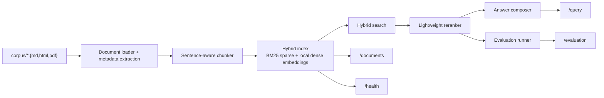

# rag-ops-platform

An auditable RAG pipeline for grounded question answering that ingests Markdown, HTML, and PDF source material, builds a transparent hybrid retrieval index, reranks candidate chunks, and returns citation-backed answers with retrieval evaluation metrics.

This repo is aimed at the production risks companies actually care about: reducing hallucinations, surfacing why retrieval failed, and making LLM-backed answers easier to trust in internal knowledge search, support copilots, and compliance-sensitive Q&A systems.

The current implementation runs fully local and does not require external model credentials or hosted vector infrastructure, so the full retrieval path stays reproducible and inspectable.

## Results

| Area | Details |
|---|---|
| Retrieval quality | Golden-set evaluation passes with `retrieval_hit_rate_at_3=1.0`, `citation_hit_rate=1.0`, and `mean_reciprocal_rank=1.0` on the shipped evaluation set. |
| Test coverage | `make test` currently passes `11` tests covering API, retrieval, chunking, grounded-answer, and evaluation paths. |
| Latency visibility | `/query` returns retrieval, answer, and total latency diagnostics; the sample query path reports millisecond-level local retrieval timing. |
| Grounding controls | Every answer includes citations, retrieved chunks, rerank scores, overlap terms, and answer-support diagnostics. |
| Deployment proof | Render deployment exposes `/evaluation`; Docker Compose and local API paths are credential-free and reproducible. |

## Overview

- RAG is treated as an inspectable system, not a single prompt call.
- Retrieval, reranking, citation coverage, and answer support are measurable before deployment.
- Failure analysis is built into the response contract through query diagnostics, ranking margins, overlap terms, and latency breakdowns.
- The same project can be discussed for GenAI Engineer, RAG Engineer, AI Backend Engineer, and LLM Applications roles without changing the underlying evidence.

## Problem

Many RAG demos show an answer but do not make the retrieval layer grounded, inspectable, or testable. This project focuses on the infrastructure around the answer: corpus ingestion, chunking, hybrid retrieval, ranking traces, citations, and evaluation hooks that reduce hallucination risk and make retrieval failures debuggable.

## Architecture

The current implementation is intentionally local and deterministic. Instead of hiding the system behind hosted vector services, the repo shows the moving parts directly:

- Markdown, HTML, and PDF documents are loaded from a versioned sample corpus.
- The ingestion layer extracts source metadata such as titles, HTML descriptions, and PDF page counts before chunking.
- The chunker creates sentence-aware chunks with one-sentence overlap.
- Each chunk is indexed with a BM25-style sparse representation and a deterministic local dense embedding built from TF-IDF + truncated SVD.
- Query-time ranking combines sparse and dense scores, then applies a simple reranker.
- The answer generator selects the highest-overlap sentences from retrieved chunks and returns citations.
- Query traces surface overlap terms, rerank margins, latency measurements, and answer-support diagnostics for operational debugging.
- A golden question set measures retrieval hit rate, citation hit rate, mean reciprocal rank, and answer/ranking diagnostics.



## Query Contract

The main request shape is intentionally small so the retrieval path stays easy to test and explain:

```json
{
  "question": "How does the platform reduce hallucinations?",
  "top_k": 3
}
```

The `/query` response returns grounded answer data, citations, a retrieval trace, and query diagnostics. The important fields are `question`, `answer`, `citations`, `retrieval`, and `diagnostics`.

## Repo Layout

```text
rag-ops-platform/
├── app/
│   ├── answering.py
│   ├── cli.py
│   ├── corpus.py
│   ├── embeddings.py
│   ├── evaluation.py
│   ├── main.py
│   ├── models.py
│   ├── retrieval.py
│   └── service.py
├── corpus/
├── eval/
└── tests/
```

## Tradeoffs

This implementation makes three deliberate tradeoffs:

1. The default dense signal is a deterministic local TF-IDF + SVD embedding fitted on the indexed corpus, not a hosted embedding API. That keeps the repo runnable without secrets while still exercising a real dense retrieval path.
2. Answer generation is extractive rather than generative. The current goal is grounded retrieval and citation quality, not free-form model fluency.
3. The corpus is small and local. This repo is proving system shape and evaluation discipline before adding remote storage or larger-scale indexing.

## Run Steps

### Local API

```bash
git clone https://github.com/srn91/rag-ops-platform.git
cd rag-ops-platform
python3 -m pip install -r requirements.txt
make run
```

Open the API docs at:

- `http://127.0.0.1:8000/docs`
- `http://127.0.0.1:8000/health`
- `http://127.0.0.1:8000/documents`

### Example Query

```bash
curl -X POST http://127.0.0.1:8000/query \
  -H "Content-Type: application/json" \
  -d '{"question":"How does the platform reduce hallucinations?","top_k":3}'
```

Example response shape:

```json
{
  "question": "How does the platform reduce hallucinations?",
  "answer": "...",
  "citations": [
    {
      "doc_id": "retrieval-quality-playbook",
      "chunk_id": "retrieval-quality-playbook-chunk-01",
      "content_type": "markdown"
    }
  ],
  "retrieval": [
    {
      "doc_id": "retrieval-quality-playbook",
      "content_type": "markdown",
      "rerank_score": 0.91,
      "overlap_terms": ["hallucinations", "platform", "reduce"],
      "embedding_provider": "local_tfidf_svd"
    }
  ],
  "diagnostics": {
    "latency_ms": {
      "retrieval": 1.2,
      "answer": 0.4,
      "total": 1.6
    },
    "ranking": {
      "retrieved_chunk_count": 3,
      "top_result_margin": 0.18
    },
    "embedding": {
      "provider": "local_tfidf_svd"
    }
  }
}
```

The default dense provider is `local_tfidf_svd`, which stays fully local and deterministic. The code also includes an optional `sentence-transformer` adapter behind the same provider interface if you install that dependency separately and want a stronger local dense signal.

### CLI Evaluation

```bash
make evaluate
```

### Docker Compose

```bash
docker compose up --build
```

The Docker path is also credential-free because retrieval uses local sparse indexing and local dense embeddings rather than external embedding APIs.

Make sure the Docker daemon is running before you start the stack. On macOS that usually means Docker Desktop is open before you run the compose command.

If host port `8000` is already occupied on your machine, you can override it without editing repo files:

```bash
RAG_PORT=8006 docker compose up --build
```

Then open the containerized API on `http://127.0.0.1:8006`.

Under the hood, `docker compose up --build` builds a dedicated image with dependencies baked in and runs the API without live-reload flags, so the container path matches the documented local deployment flow rather than a development-only shell command.

## Hosted Deployment

- Live URL: `https://rag-ops-platform.onrender.com`
- Click first: [`/evaluation`](https://rag-ops-platform.onrender.com/evaluation)
- Browser smoke: Render-hosted `/evaluation` loaded in a real browser and returned the live retrieval-quality summary with all three golden cases present.
- Render service config: Python web service on `main`, auto-deploy on commit, region `oregon`, plan `free`, build `pip install -r requirements.txt`, start `uvicorn app.main:app --host 0.0.0.0 --port $PORT`, health check `/health`.
- Render deploy command: `render deploys create srv-d7n6572pmmbs73cb5i10 --confirm`

## Validation

The repo includes three verification paths:

- `make lint` runs Ruff against the application and tests.
- `make test` exercises the API, retrieval, chunking, grounded-answer, and evaluation paths with pytest.
- `make evaluate` runs the golden question set and reports retrieval hit rate, citation hit rate, mean reciprocal rank, and answer-support diagnostics.

Expected local verification flow:

```bash
make verify
```

Current verification snapshot from the latest local run:

- `make lint`: passed
- `make test`: passed (`11 passed`)
- `make evaluate`: passed with `retrieval_hit_rate_at_3=1.0`, `citation_hit_rate=1.0`, `mean_reciprocal_rank=1.0`, plus latency, faithfulness, completeness, and rerank-margin diagnostics

## Capabilities

The current implementation supports:

- corpus ingestion from versioned Markdown, HTML, and PDF files
- source metadata extraction for titles, HTML descriptions, and PDF page counts
- sentence-aware chunking with overlap
- hybrid retrieval using sparse and deterministic local dense embedding signals
- a pluggable embedding provider boundary, with an optional sentence-transformer adapter in code when that dependency is installed locally
- reranked, citation-backed answers
- per-query latency, faithfulness, completeness, and ranking diagnostics in both `/query` and `/evaluation`
- document inventory and health endpoints that surface source metadata and the active embedding provider
- retrieval evaluation with golden questions
